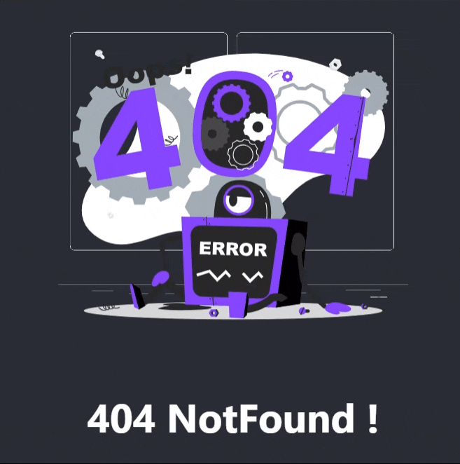

# NotFound Component

The `NotFound` component is a React functional component that displays a 404 Not Found message along with an animation and an optional button.



## Installation

```bash
npm i react-notfound-page
```

## Props

The `NotFound` component accepts the following props:

| Prop              | Type                               | Default Value           | Description                                        |
|-------------------|------------------------------------|-------------------------|----------------------------------------------------|
| `ButtonComponent` | `React.FC` (optional)             | `() => null`            | A custom button component to render.               |
| `text`            | `string` (optional)               | `'404 NotFound !'`      | The text to display in the Not Found message.      |
| `rootClassName`   | `string` (optional) | `''`                | Additional class names for the root container.     |
| `textClassName`   | `string` (optional) | `''`                | Additional class names for the text element.       |

## Example Usage

Below is an example of how to use the `NotFound` component in your application:

```tsx
import React from 'react';
import NotFound from 'react-notfound-page';

const CustomButton = () => (
  <button className="btn btn-primary">Go Back</button>
);

const AppNotFoundPage = () => {
  return (
    <div>
      <NotFound 
        ButtonComponent={CustomButton} 
        text="Page Not Found" 
        textClassName="text-red-500" 
        rootClassName="my-custom-class" 
      />
    </div>
  );
};

export default AppNotFoundPage;
```

## License

This component is open source and available under the [MIT License](LICENSE).
